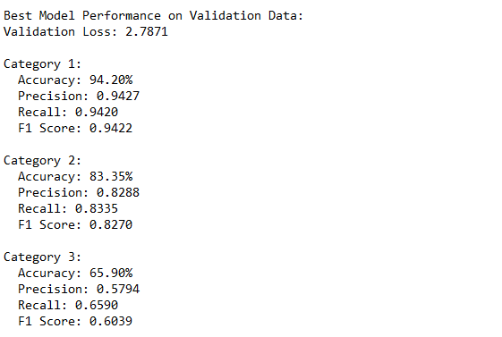

# Hierarchical_Text_Classification_BERT

This project implements a hierarchical text classification model for product reviews using BERT. It classifies reviews into three levels of categories (Cat1, Cat2, Cat3) based on the review text.

## Problem Statement

For text documents, we often need to extract context and classify them into hierarchical categories. This project aims to classify given product review texts into a hierarchy of classes.

## Data Description

The dataset contains product reviews with the following fields:
- ProductID: Unique ID of the product
- Title: Title of the review
- UserID: Unique ID of the user
- Time: Timestamp of the review
- Text: Review of the product given by the user
- Cat1: First level category
- Cat2: Second level category
- Cat3: Third level category

You can download dataset from [this link](https://drive.google.com/file/d/1lSrw8bvb9z9-kVnpvorNCFW1f-MTv5yX/view?usp=sharing).

## Project Structure

- `data_preprocessing.py`: Contains functions for data cleaning and preprocessing
- `model.py`: Defines the hierarchical BERT-based model architecture
- `dataset.py`: Implements a custom PyTorch Dataset for handling the review data
- `trainer.py`: Contains the custom training loop and logic
- `evaluation.py`: Implements functions for model evaluation
- `main.py`: The main script that ties everything together and runs the entire pipeline

## Requirements

You can install the required packages using: `pip install -r requirements.txt`

## Usage

1. Ensure your data is in CSV format and update the `csv_path` in `main.py`.
2. Run the main script: `python main.py`

This will preprocess the data, train the model, and evaluate its performance.

## Model Architecture

The model uses BERT as its base and adds three classification heads on top, one for each category level. The architecture is hierarchical, with predictions for lower levels using information from higher levels.

## Trained Model

The logs for trained model can be found at [this link](https://drive.google.com/file/d/1JnePVmkfaRqsIyK2UNbhMRUE_qMSZPtm/view?usp=drive_link). You can download the pre-trained model from [this link](https://drive.google.com/file/d/11LRc58OFsEeE-5a5Y60L-UPyr33cgJ6V/view?usp=sharing).

To use the pre-trained model, download it and place it in the project directory. 

## Evaluation Metrics

The model is evaluated using the following metrics for each category level:
- Accuracy
- Precision
- Recall
- F1 Score

## Results

Our model achieved the following performance on the test set:

## Future Work

- Experiment with other transformer-based models like RoBERTa or ALBERT
- Implement data augmentation techniques to improve performance
- Explore multi-task learning approaches for the hierarchical classification

## Contributing

Feel free to open issues or submit pull requests if you have suggestions for improvements or find any bugs.

## License

This project is licensed under the MIT License - see the [LICENSE.md](LICENSE.md) file for details.
